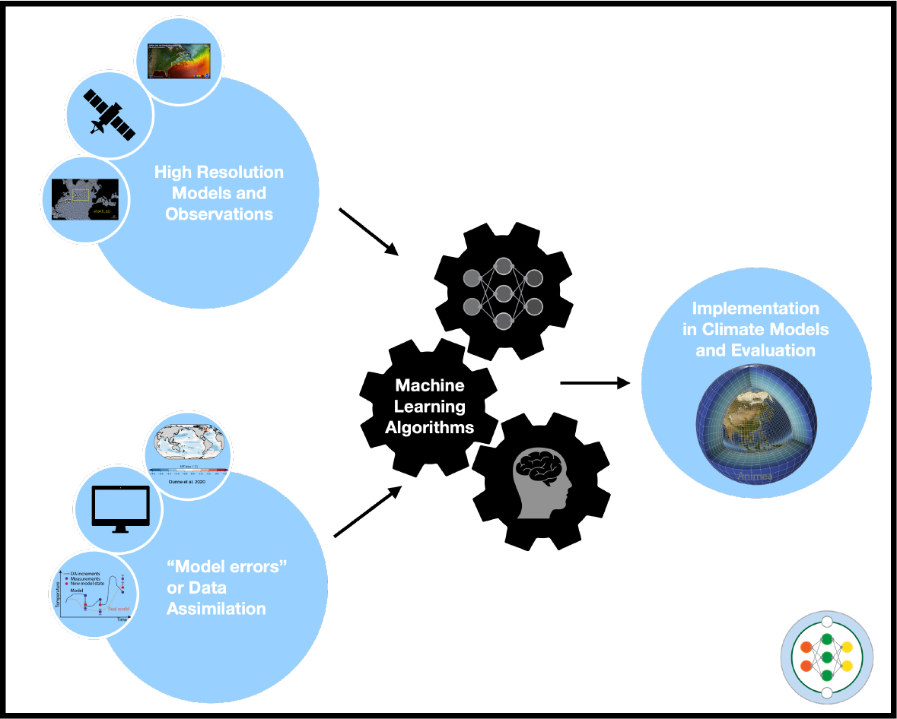

## Project Goal

The international team will leverage advances in machine learning and the availability of big data to improve our understanding and representation in existing climate models of vital atmospheric, oceanic, and ice processes, such as turbulence or clouds. The deeper understanding and improved representations of these processes will help deliver more reliable climate projections

Due to the complexity of the atmosphere, ocean, and ice systems, scientists rely on computer simulations, or **climate models**, to describe their evolution. These climate models break the components of the climate system into a series of **grid boxes** to imitate how the ocean, atmosphere, and ice are changing and interact with each other. The issue is that the number of grid boxes selected is **limited by computer power**. Currently, climate models for multi-decade projections use grid box sizes measuring approximately 50 km to 100 km (roughly 30 to 60 miles). As a result, physical processes that occur on **scales that are smaller than the grid box** (e.g., clouds, turbulence, and ocean mixing) of climate models are not well captured.    

The **M²LInES** initiative is using the wealth of newly available datasets and **machine learning** to deepen our understanding and better capture these unaccounted physical processes. These machine learning models will guide physics-discovery and help reduce the imprecision of existing climate simulations by **providing high-resolution dynamics from low-resolution observables**.  

Below is a schematic of our workplan: 

